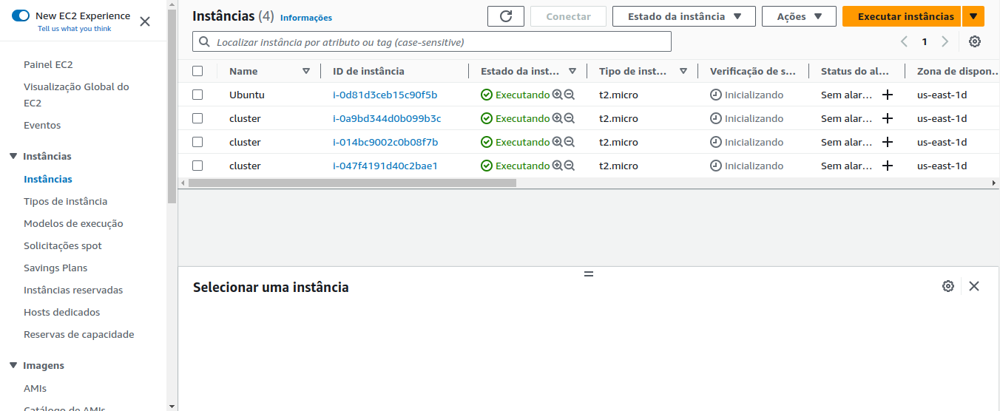
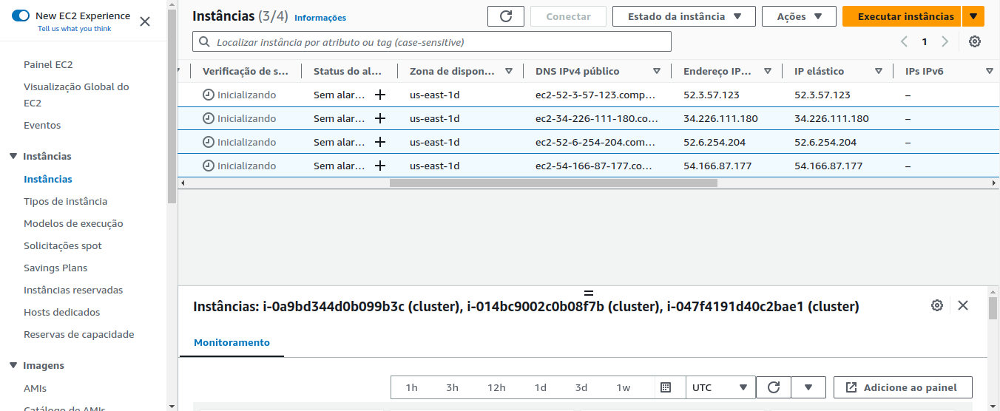
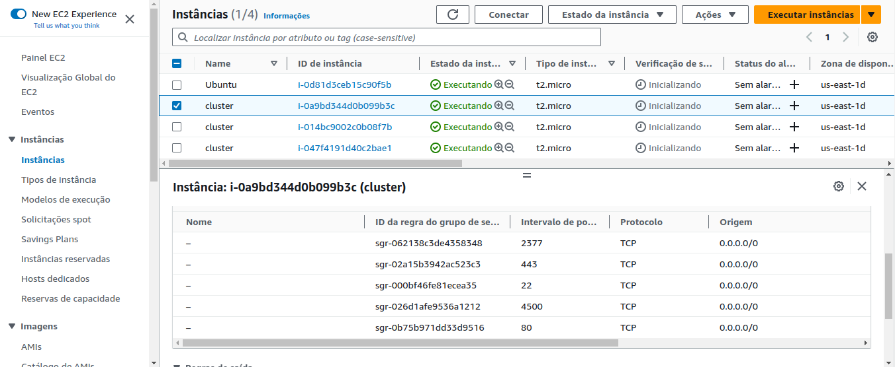

# Configuração do Docker Swarm e do balanceamento de carga

Na plataforma da AWS, foram realizados os seguintes passos:

1. Criar três máquinas virtuais Ubuntu e alocar um IP elástico para cada uma delas. Para este projeto, foram criadas as instâncias _cluster_:

<div align="center">
  
  <br>
  <br>
  
</div>
<br>

2. Instalar o Docker nas máquinas com o seguinte comando:

```
curl -fsSL https://get.docker.com -o get-docker.sh

sudo sh get-docker.sh
```

3. Configurar as portas 4500 e 2733 para protocolo TCP:

<div align="center">
  
</div>
<br>

Obs.: Esse tipo de configuração pode ser realizada diretamente pelo terminal usando os comandos:

```
sudo ufw allow 2377/tcp
sudo ufw allow 4500/tcp
```

4. Renomear as máquinas da seguinte forma:

```
hostnamectl set-hostname master # Para a máquina master
hostnamectl set-hostname node1  # Para a primeira máquina do balanceamento
hostnamectl set-hostname node2  # Para a segunda máquina do balanceamento
```

5. Na máquina master, criar o arquivo nginx.conf usando o comando:

```
nano nginx.conf
```

Este arquivo é o responsável por determinar as configurações do proxy.

6. Inserir o seguinte conteúdo no arquivo nginx.conf:

```
http {

upstream all {
	server 34.226.111.180:80; // seu ip + porta
	server 52.6.254.204:80; // seu ip + porta
	server 54.166.87.177:80; // seu ip + porta
}

server {
	 listen 4500;
	 location / {
	      proxy_pass http://all/;
	 }
}

}

events { }
```

7. Criar um arquivo Dockerfile (nano Dockerfile) com o conteúdo abaixo:

```
FROM nginx
COPY nginx.conf /etc/nginx/nginx.conf
```

O arquivo Dockerfile, em linhas gerais, serve como a receita para construir um container, ou seja, por meio dele vocẽ tem a possibilidade de definir um ambiente personalizado e próprio para determinado projeto.

8. Criar uma imagem para rodar a aplicação usando o comando:

```
docker build . -t study // substitua "study" pelo nome da imagem que desejar
```

9. Para executar o container na porta 4500, use o comando:

```
docker run -d -p 4500:4500 --name study_manager study
```

10. Criar um volume para o compartilhamento de dados ou arquivos entre os conteiners no mesmo node com o comando:

```
docker volume create app
```

11. Criar um serviço para o projeto usando o volume criado:

```
docker service create --name site --replicas 10 -d -p 80:80 --mount type=volume,src=app,dst=/usr/local/apache2/htdocs httpd
```

12. Inicializar o Docker Swarm na máquina master com o seguinte comando:

```
docker swarm init
```

13. Ao iniciar o Docker Swarm será gerada uma chave (token). Esse token será inserido nas máquinas de balanceamento (node1 e node2) com um comando semelhante a este:

```
docker swarm join --token SWMTKN-1-0x3gimqxscvxspokupwhutw8wspjujsud3hjd5s4wudmg1er0s-boaulopoluofrimd7mknovx87
172.31.34.172:2377
```

14. Com isso, o Docker Swarm estará configurado com balanceamento de carga usando Nginx e um volume para o site.

15. Para exibir o conteúdo executado em cada máquina, basta abrir o navegador e inserir na barra de endereços o IP da máquina e o número da porta (4500).

16. Além disso, para alterar o conteúdo exibido em cada uma das três páginas, basta alterar o corpo do documento index.html em cada uma das instâncias:

```
nano /var/lib/docker/volumes/app/_data/index.html
```
